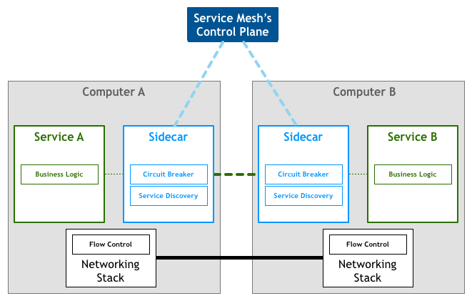
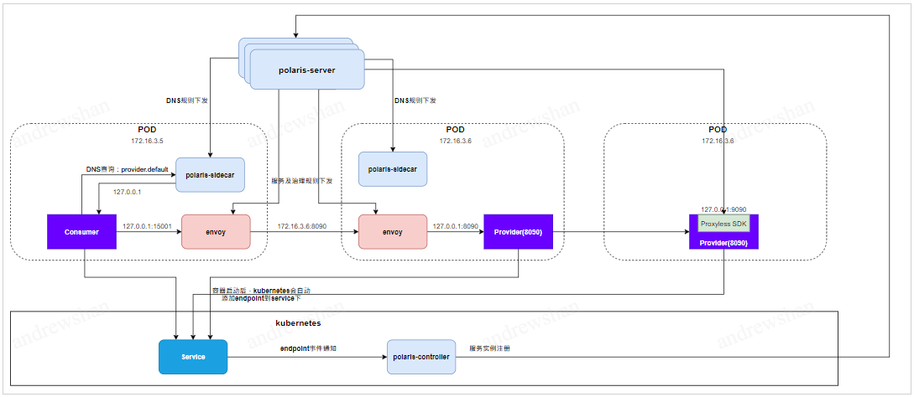
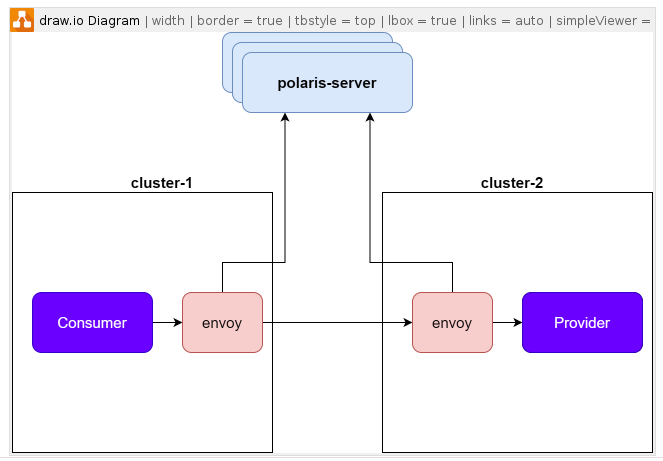
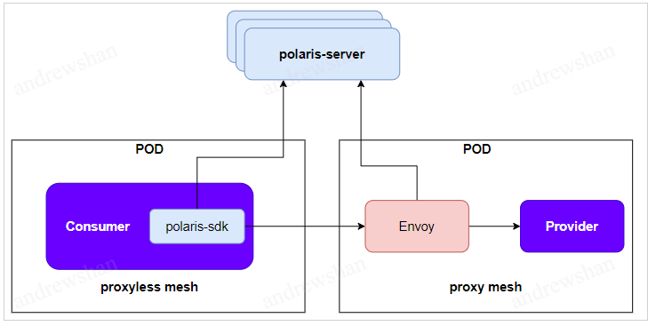

# 概念及原理

## 什么是服务网格

服务网格（service mesh），作为服务间通信的基础设施层，最早出现在 Buoyant 公司的 CEO Willian Morgan 在他的这篇文章 [WHAT’S A Service Mesh? AND WHY DO I NEED ONE](https://buoyant.io/2017/04/25/whats-a-service-mesh-and-why-do-i-need-one/)中：

```
服务网格（Service Mesh）是处理服务间通信的基础设施层。
它负责构成现代云原生应用程序的复杂服务拓扑来可靠地交付请求。
在实践中，Service Mesh 通常以轻量级网络代理阵列的形式实现，这些代理与应用程序代码部署在一起，对应用程序来说无需感知代理的存在。
```

服务网格的出现，可以让应用开发者更专注于业务本身的开发，无须关心服务之间的那些原本通过服务框架实现的事情，比如服务流量调度，服务高可用，服务鉴权等服务治理相关的事情。

服务网格通过透明代理来为应用完成这些服务治理的相关事情：



## 北极星如何支持服务网格

北极星提供服务网格的接入能力，用户使用北极星可以轻松得接入服务网格，其实现原理如下：



- 被调方应用在POD启动时，k8s会自动将pod ip注册到k8s service中，polaris-controller监听到注册事件后，会同时往北极星服务端注册服务实例。

- 每个POD中，除了业务容器外，还有额外存在两个容器
  - polaris-sidecar容器，负责接管POD中的DNS请求，对服务调用的DNS请求重定向给envoy容器。
  - envoy容器，负责接管应用的业务流量，接受业务的请求并进行流量调度。

- polaris-server会通过XDS的方式，下发服务数据、规则数据以及DNS数据到envoy以及polaris-sidecar中。

- 主调方以域名方式发起服务调用时，根据iptables规则，会将DNS请求转发给polaris-sidecar容器，polaris-sidecar容器将含有服务名的DNS请求解析成envoy的地址。

- Consumer根据DNS解析结果，向envoy发起请求调用，envoy根据polaris-server下发的服务数据，进行流量调度，最终转发给Provider所在的POD。

- Provider收到请求后，通过iptables规则，转发到envoy中处理，envoy进行一些被调的治理操作（比如熔断，鉴权等），最终通过127.0.0.1的IP转发给Provider应用。


## 北极星服务网格的优势

### 跨集群的服务发现更简单

北极星是一个计算与存储分离的系统，具备极强的可扩展性，一个北极星集群可以支持多个k8s集群同时接入。

接入到同一个北极星的集群的多个k8s集群中的应用，可以共享同一份服务数据，实现集群间的无感知调用。



### 支持proxyless网格

北极星提供了多种SDK，可以支持当下比较流行的proxyless网格模式的接入，同时，由于北极星采用了统一的服务治理模型，因此，可以通过同一份服务治理的规则配置，同时应用到proxyless和proxy的应用中，实现统一的服务治理体验。

