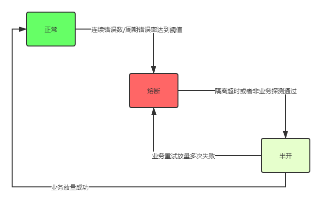
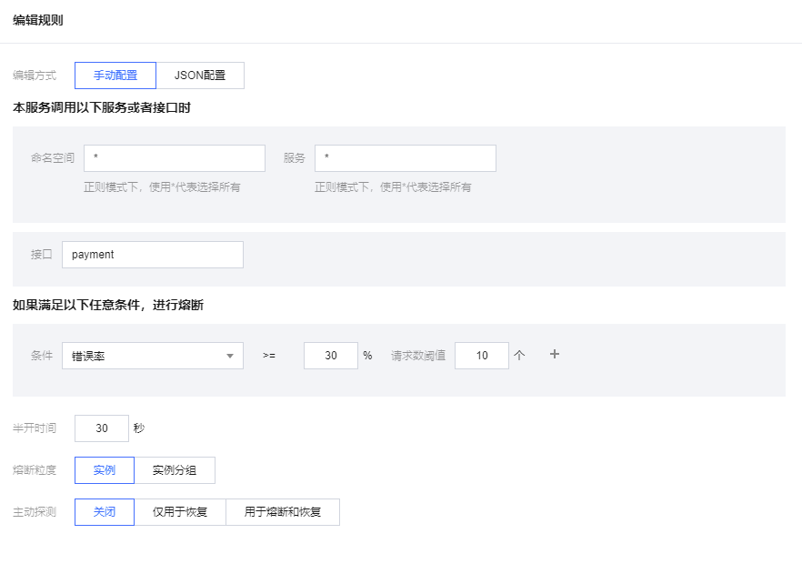
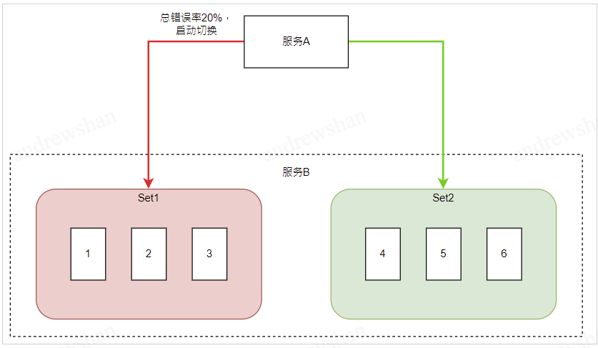
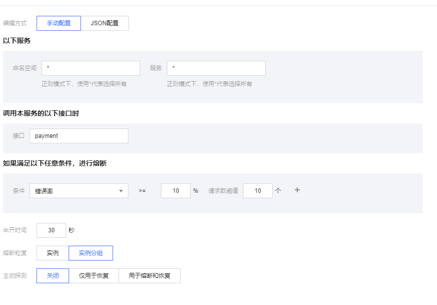

# 故障熔断

## 什么是故障熔断

故障熔断的是北极星提供的一种在主调方侧迅速自动屏蔽错误率高或故障的服务实例，防止故障扩散，提升业务成功率的一种机制。

故障熔断默认开启。可以通过SDK本地配置或者远程配置的方式进行修改和调整策略。如果一个被调连续错误10次 或 最近一分钟请求大于10且错误率大于50%  则触发故障熔断。

注意：节点熔断后，每30s会进入半开状态释放少量请求进行恢复探测，业务可根据自己需求配置网络探测，网络探测成功以后才进入半开。或者调大进入半开探测恢复的时间间隔。

## 故障熔断机制

### 状态图



### 触发故障熔断

北极星的故障熔断机制是插件化的方式实现，开发者可以自由去定制各种熔断策略。下文主要介绍北极星内置的2个最常用的熔断策略：基于连续错误数熔断以及基于错误率阈值熔断。

#### 连续错误数熔断

在统计周期（默认1分钟）内，连续异常数目超过阈值（熔断配置中的continuousErrorThreshold，默认10）之后，节点进入熔断状态，即在接下的时间窗口（熔断配置中的sleepWindow)，该节点不参与调度（在非全死全活情况下不会被服务发现接口所返回）。

#### 错误率熔断

当资源的每分钟请求量 >= N（可配置，默认10次），并且每分钟异常总数占通过量的比值超过阈值（熔断配置中的errorRateThreshold）之后，节点进入熔断状态，即在接下的时间窗口（熔断配置中的sleepWindow，默认30s)，该节点不参与调度（在非全死全活下不会被服务发现接口所返回）。

### 熔断恢复机制

半开机制：节点进入熔断状态后，通过以下2个途径，该熔断节点会进入半开状态（业务探测状态）。

即在接下来统计周期中，该节点会被允许调度少量的业务请求。当这些业务请求的成功率符合阈值（熔断配置中的successCountAfterHalfOpen，默认10个），节点才会正式恢复：

-  通过主动探测进入半开：假如用户开启了主动探测（默认不开启），则SDK内部会启动定时任务，对熔断的节点进行探测，探测通过后，节点进入半开状态；
- 通过超时进入半开：用户没有开启主动探测的前提下，熔断的节点在时间窗（sleepWindow）过了后，会自动进入半开状态。

### 全死全活机制

为了防止网络闪断导致集群节点全熔断，从而由于无可用节点导致业务路由失败的情况发生，北极星默认会开启全死全活机制：当某个路由目标集群剩余健康节点数据达到了一定百分比阈值（可配置，默认为0）了，北极星会默认放通该目标集群的所有实例。

如果想修改或关闭全死全活机制，可以通过修改路由配置参数来实现。

```
consumer:
  serviceRouter:
    plugin:
      recoverRouter:
        #是否启用全死全活插件
        enable: true
        #剩余节点低于某个百分比时，就全量返回，如果不填，默认0%，即全死全活
        percentOfMinInstances: 0
```

## 使用故障熔断

### 上报调用结果

由于北极星不接管流量，因此节点的健康度依赖于用户每次请求后主动上报请求的调用结果，然后北极星SDK对调用结果进行汇总计算，作为熔断的判断依据。上报请求调用结果的逻辑是纯内存计算，不会进行网络IO，所以对业务性能不存在影响。

用户可通过updateServiceCallResult方法来进行调用结果的上报，在每次业务请求调用完毕后，需要主动使用这个方法来上报业务调用情况。

```java
ServiceCallResult result = new ServiceCallResult();
// 设置本次调用的目标服务命名空间
result.setNamespace(namespace);
// 设置本次调用的目标服务名
result.setService(service);
// 设置本次调用的目标实例IP
result.setHost(targetInstance.getHost());
// 设置本次调用的目标实例端口
result.setPort(targetInstance.getPort());
// 设置本次调用的返回码
result.setRetCode(httpResult.code);
// 设置本次调用的时延
result.setDelay(delay);
// 设置本次调用结果是成功还是失败
result.setRetStatus(status);
// 调用updateServiceCallResult将结果写入到北极星SDK内存
consumerAPI.updateServiceCallResult(result);
```

```go
//构造请求，进行服务调用结果上报
svcCallResult := &api.ServiceCallResult{}
//设置被调的实例信息
svcCallResult.SetCalledInstance(targetInstance)
//设置服务调用结果，枚举，成功或者失败
svcCallResult.SetRetStatus(api.RetSuccess)
//设置服务调用返回码
svcCallResult.SetRetCode(0)
//设置服务调用时延信息
svcCallResult.SetDelay(consumeDuration)
//执行调用结果上报
err = consumer.UpdateServiceCallResult(svcCallResult)
```

### 对服务实例进行熔断

#### 场景描述

服务A调用第三方服务B，在服务调用过程中，服务B的部分实例出现了故障， 服务A通过实时统计服务B的请求成功失败率，得知这部分的实例触发了熔断阈值，将故障的实例给剔除。

#### 使用方式

- 熔断规则解读

北极星的熔断规则分为主调规则和被调规则，可支持根据不同的场景，设置不同的熔断规则。

  - 被调规则：基于被调方服务进行设置。用于，被调方服务上线时，预设的熔断规则，标识该被调服务的熔断触发条件。
  - 主调规则：基于主调方服务进行设置。一般用于被调方无法设置规则的场景（比如调用第三方服务）。
  - SDK本地规则：各语言SDK预设的熔断规则，没有远程规则时，则使用SDK预设的规则。

规则匹配的优先级：被调规则 > 主调规则 > SDK本地规则。

- 配置熔断规则

  

- 执行服务实例熔断

  可以执行各语言的故障熔断样例来进行实例熔断的测试，各语言样例及执行结果如下：


### 对实例分组进行熔断

#### 场景描述

在容灾架构中，内网服务一般是按SET进行容灾部署，每个SET都是单独进行运维和升级。为了针对SET升级过程引入的故障，可以快速进行切换。因此，北极星提供了按实例分组（SET）进行熔断的机制。按SET的维度统计错误率和错误数，达到阈值则进行熔断剔除。

  

#### 使用方式

- 配置熔断规则

  

- 执行服务实例熔断

  可以执行各语言的故障熔断样例来进行实例分组熔断的测试，各语言样例及执行结果如下：


