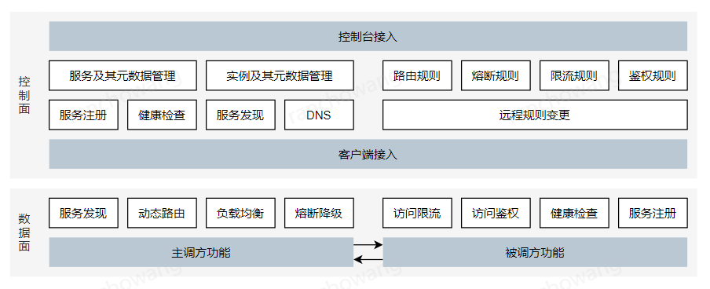

# 简介

北极星是腾讯开源的服务发现和治理中心，致力于解决分布式或者微服务架构中的服务可见、故障容错、流量控制和安全问题。虽然，业界已经有些组件可以解决其中一部分问题，但是缺少一个标准的、多语言的、框架无关的实现。

腾讯具有海量的分布式服务，加上业务线和技术栈的多样性，沉淀了大大小小数十个相关组件。从 2019 年开始，我们通过北极星对这些组件进行抽象和整合，打造公司统一的服务发现和治理方案，帮助业务提升研发效率和运营质量。

目前，北极星在腾讯的服务注册数量超过百万，日接口调用量超过十万亿，通用性和稳定性都得到了大规模的验证。因此，我们将其贡献到开源社区，希望对其他企业有所帮助，也希望吸引更多开发者参与共建。下面从三个方面介绍北极星。

## 北极星解决哪些问题

在分布式服务调用的过程中，业务可能面临以下四类问题。北极星以服务为中心，提供一站式解决方案。

| 问题类型 | 问题示例 | 解决方案 |
| - | - | - |
| 服务可见 | 主调方如何知道被调方的服务地址 | 注册发现 |
| 故障容错 | 当被调方的部分实例异常时，如何屏蔽异常实例，屏蔽之后如何恢复 | 熔断降级 |
|          | 当某些主调方的请求量过多时，如何限制这些主调方的请求，避免影响其他主调方的请求 | 访问限流 |
| 流量控制 | 通常被调方包含多个实例，主调方如何确定请求发送到哪个实例，如何保证请求均衡 | 负载均衡 |
|          | 如果被调方实例部署在多个地域，主调方如何就近访问 | 动态路由 |
| 安全     | 被调方如何判断是否允许某个主调方访问 | 访问鉴权 |

## 北极星具备哪些功能

北极星控制面主要提供三大部分功能：

- 服务注册、健康检查和服务发现
- 支持以 DNS 的方式进行服务发现
- 服务治理规则的管理和下发

北极星数据面采用插件化的方式实现，每个功能可以选择使用：

- 基础功能：服务发现、服务注册、健康检查
- 故障容错：熔断降级、访问限流
- 流量控制：动态路由、负载均衡
- 安全：访问鉴权

## 北极星包含哪些组件

北极星系统组件分为核心组件和生态组件两类：

- 核心组件：控制台、控制面和数据面
- 生态组件：对接常用的开源框架和网关，对接 kubernetes

数据面支持高性能 SDK 和无侵入 Sidecar，两种模式可以互相调用：

- SDK：不劫持业务请求，几乎不增加请求延时，CPU 消耗低，不需要部署和运维 Sidecar
- Sidecar：劫持业务请求，有一定的请求延时，CPU 消耗较高，适用于无侵入的开发场景

北极星兼容常用的开源框架、网关和 kubernetes：

- 支持 grpc 等框架和北极星 SDK 的集成，框架用户不需要直接使用北极星 SDK
- 支持 nginx 等网关和北极星 SDK 的集成，支持网关将请求转发到北极星服务
- 支持 k8s service 自动注册到北极星，实现 k8s service 和框架服务的统一管理
