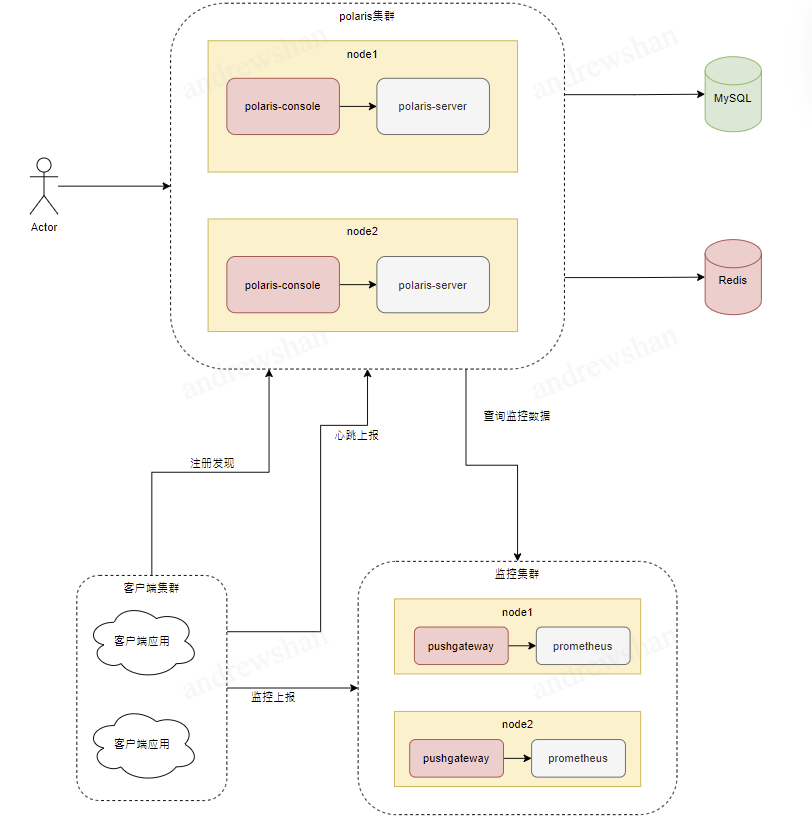

# 集群版安装

- [集群版安装](#集群版安装)
  - [集群版功能说明](#集群版功能说明)
  - [最小生产组网规格](#最小生产组网规格)
  - [核心功能安装](#核心功能安装)
    - [下载地址](#下载地址)
    - [集群组网](#集群组网)
    - [初始数据导入](#初始数据导入)
    - [虚拟机linux](#虚拟机linux)
      - [安装polaris-server](#安装polaris-server)
      - [安装polaris-console](#安装polaris-console)
    - [容器化](#容器化)
  - [健康检查功能安装](#健康检查功能安装)
    - [集群组网](#集群组网-1)
    - [虚拟机linux](#虚拟机linux-1)
      - [开启健康检查功能](#开启健康检查功能)
    - [容器化](#容器化-1)
  - [可观察性功能安装](#可观察性功能安装)
    - [集群组网](#集群组网-2)
    - [虚拟机linux](#虚拟机linux-2)
      - [安装promethues](#安装promethues)
      - [安装pushgateway](#安装pushgateway)
    - [容器化部署](#容器化部署)

---

## 集群版功能说明

| 类型     | 系统组件                           | 第三方依赖                           | 功能说明           |
| -------- | ---------------------------------- | ------------------------------------ | ------------------ |
| 核心(必选)     | polaris-console,  polaris | MySQL，版本>=5.7                      | 服务治理、配置中心 |
| 健康检查(可选) | -               | Redis，版本>=4.0                  | 心跳上报           |
| 可观察性(可选) | -                                  | Prometheus 2.28.0，PushGateway 1.4.1 | 可观测性 |

## 最小生产组网规格

| 节点类型                  | 节点数量 | 规格要求                  |
| ------------------------- | -------- | ------------------------- |
| polaris-console & polaris | 2        | CentOS 7.5，2C4G，存储10G |
| MySQL                     | 1主1备        | 1C2G，存储10G             |
| Redis                     | 1主1备    | 1C2G                      |
| Prometheus & PushGateway  | 1主1备    | 1C2G                      |

## 核心功能安装

### 下载地址

执行所有安装之前，需要下载软件包，可以从以下2个地址下载集群版软件包，请选择最新的release版本：

- Github下载：
  - [polaris releases](https://github.com/polarismesh/polaris/releases)
  - [polaris-console releases](https://github.com/polarismesh/polaris-console/releases)
- Gitee下载：
  - [polaris release](https://gitee.com/polarismesh/polaris/releases)
  - [polaris-console releases](https://gitee.com/polarismesh/polaris-console/releases)

### 集群组网


为保证容灾性，建议2节点部署，建议每台机器上**同时部署polaris-server与polaris-console**。

### 初始数据导入

先下载对应版本的源码包：Source code (zip) 

解压源码包并执行导入：

> 首次安装

```bash
unzip polaris-$version.zip
cd polaris-$version
mysql -u $db_user -p $db_pwd -h $db_host < store/sqldb/scripts/polaris_server.sql
```

> 非首次安装，执行升级**store/sqldb/scripts/delta**中的升级脚本

```bash
unzip polaris-$version.zip
cd polaris-$version
mysql -u $db_user -p $db_pwd -h $db_host < store/sqldb/scripts/delta/v160-v170.sql
```

### 虚拟机linux

#### 安装polaris-server

- 下载软件包：下载polaris-server-release_$version.linux.$arch.zip，解压后进入polaris-server-release_$version.linux.$arch目录

- 配置数据库参数：修改polaris-server.yaml里面的存储配置，去掉boltdbStore相关配置，并放开defaultStore相关配置
```
# 存储配置
store:
# 数据库存储插件
  name: defaultStore
  option:
    master:
      dbType: mysql
      dbName: polaris_server
      dbAddr: 数据库地址，格式为ip:port
      dbUser: 数据库用户名
      dbPwd: 数据库密码
```

- 开启自动注册：修改polaris-server.yaml里面的服务自注册配置：
```
bootstrap:
  polaris_service:
    # 设置为true代表启用自动注册
    enable_register: true
    # 填入数据库地址，用于获取当前节点ip信息
    probe_address: 数据库地址
```

- 启动polaris-discover：
```
bash ./tool/start.sh
bash ./tool/p.sh
输出信息：./polaris-server start
```

#### 安装polaris-console

- 下载软件包：下载polaris-console-release_$version.linux.$arch.zip，解压后进入polaris-console-release_$version.linux.$arch目录

- 启动polaris-console：
```
bash ./tool/start.sh
bash ./tool/p.sh
输出信息：./polaris-console start
```

- 登录控制台的默认登录账户信息

```
用户：polaris
密码：polaris
```

### 容器化

- 下载软件包：下载polaris-standalone-release_$version.kubernetes.zip，解压后进入polaris-standalone-release_$version.kubernetes目录

- 配置数据库参数：修改01-polaris-server-config.yaml里面的存储配置，去掉boltdbStore相关配置，并放开defaultStore相关配置
```
# 存储配置
store:
# 数据库存储插件
  name: defaultStore
  option:
    master:
      dbType: mysql
      dbName: polaris_server
      dbAddr: 数据库地址，格式为ip:port
      dbUser: 数据库用户名
      dbPwd: 数据库密码
```

- 开启自动注册：修改01-polaris-server-config.yaml里面的服务自注册配置：
```
bootstrap:
  polaris_service:
    # 设置为true代表启用自动注册
    enable_register: true
    # 填入数据库地址，用于获取当前节点ip信息
    probe_address: 数据库地址
```

- 调整副本数：修改02-polaris-server.yaml里面的StatefulSet的spec.replicas字段，为保证容灾性，需要至少2节点：
```
spec:
  replicas: 2
```

- 启动polaris-server和polaris-console：
```
kubectl create -f 00-polaris-console-config.yaml 
kubectl create -f 01-polaris-server-config.yaml  
kubectl create -f 02-polaris-server.yaml
```


## 健康检查功能安装

### 集群组网


为保证容灾性，需要2节点（VM/POD）进行部署。

### 虚拟机linux

#### 开启健康检查功能

在步骤一安装完server后，执行以下操作可开启健康检查功能。

- 编辑配置：修改polaris-server.yaml里面的健康检查配置

```
healthcheck:
  # 设置为true代表启用健康检查
  open: true
  service: polaris.checker
  slotNum: 30
  minCheckInterval: 1s
  maxCheckInterval: 30s
  batch:
    heartbeat:
      open: true
      queueSize: 10240
      waitTime: 32ms
      maxBatchCount: 32
      concurrency: 64
  checkers:
  - name: heartbeatRedis
    option:
	  #填入redis的IP以及端口
      kvAddr: ##REDIS_ADDR##
	  #填入redis的密码
      kvPasswd: ##REDIS_PWD##
      maxIdle: 200
      idleTimeout: 120s
      connectTimeout: 200ms
      msgTimeout: 200ms
      concurrency: 200	
```

- 重新启动polaris-server：

```
bash ./tool/stop.sh
bash ./tool/start.sh
bash ./tool/p.sh
输出信息：./polaris-server start
```

### 容器化

在步骤一安装完server后，执行以下操作可开启健康检查功能。

- 编辑配置：修改01-polaris-server-config.yaml里面的健康检查配置

```
healthcheck:
  # 设置为true代表启用健康检查
  open: true
  service: polaris.checker
  slotNum: 30
  minCheckInterval: 1s
  maxCheckInterval: 30s
  batch:
    heartbeat:
      open: true
      queueSize: 10240
      waitTime: 32ms
      maxBatchCount: 32
      concurrency: 64
  checkers:
  - name: heartbeatRedis
    option:
	  #填入redis的IP以及端口
      kvAddr: ##REDIS_ADDR##
	  #填入redis的密码
      kvPasswd: ##REDIS_PWD##
      maxIdle: 200
      idleTimeout: 120s
      connectTimeout: 200ms
      msgTimeout: 200ms
      concurrency: 200	
```


- 更新configmap并重启polaris-server：

```
kubectl replace -f 01-polaris-server-config.yaml
kubectl rollout restart statefulset polaris
```


## 可观察性功能安装

### 集群组网




### 虚拟机linux

#### 安装promethues

- 下载软件包：点击[下载链接](https://github.com/prometheus/prometheus/releases/download/v2.28.0/prometheus-2.28.0.linux-amd64.tar.gz)，下载prometheus版本，解压后进入prometheus-2.28.0.linux-amd64目录中。

- 修改配置：打开 prometheus.yml文件，在最下面添加pushgateway的相关配置

```
  - job_name: 'push-metrics'
    static_configs:
    - targets: ['localhost:9091']
    honor_labels: true     
```

- 启动prometheus：
```
nohup ./prometheus --web.enable-lifecycle --web.enable-admin-api >> prometheus.out 2>&1 &
```

#### 安装pushgateway

- 下载软件包：点击[下载链接](https://github.com/prometheus/pushgateway/releases/download/v1.4.1/pushgateway-1.4.1.linux-amd64.tar.gz)，下载pushgateway版本，解压后进入pushgateway-1.4.1.linux-amd64目录中。

- 启动pushgateway：

```
nohup ./pushgateway --web.enable-lifecycle --web.enable-admin-api >> pgw.out 2>&1 &
```

### 容器化部署

- 执行命令安装：

```
kubectl create -f 03-prometheus.yaml
```
