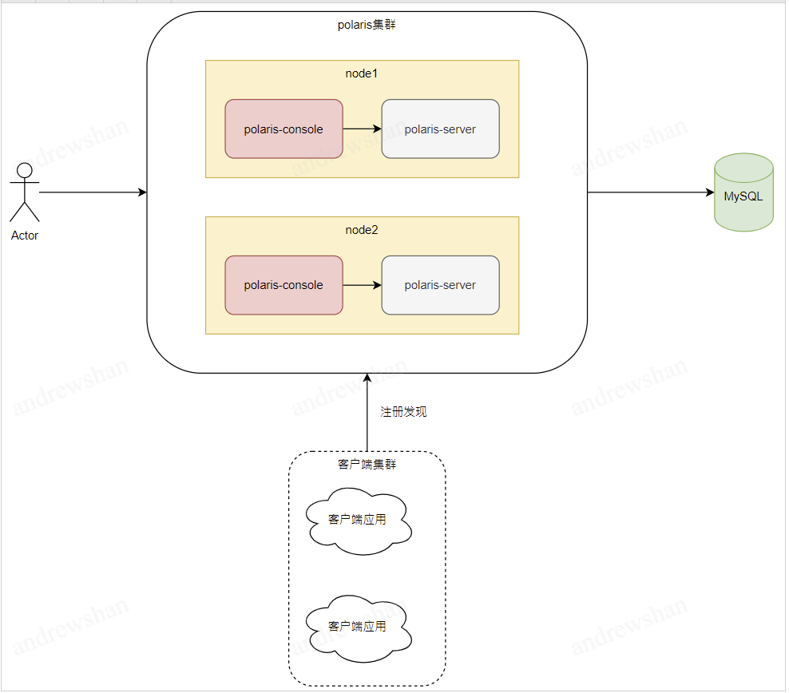

# 安装集群版

## 集群版功能说明

| 类型     | 组件                               | 最小生产集群 | 第三方依赖                           | 功能说明           |
| -------- | ---------------------------------- | ------------ | ------------------------------------ | ------------------ |
| 核心(必选)     | polaris-console,  polaris-discover | 2*VM/4*POD   | MySQL 5.7                            | 服务注册，服务发现 |
| 健康检查(可选) | polaris-healthcheck                | 2*VM/4*POD   | Redis 5.0                            | 心跳上报           |
| 可观察性(可选) | -                                  | 4*VM/8*POD   | Prometheus 2.28.0, PushGateway 1.4.1 | 客户端监控上报     |


## 核心功能安装

### 集群组网



为保证容灾性，需要至少2节点部署，建议每台机器上**同时部署polaris-server与polaris-console**。

### 初始数据导入

在polaris的[releases](https://github.com/polarismesh/polaris/releases)上下载对应版本的源码包：Source code (zip) 

解压源码包并执行导入：

```bash
unzip polaris-$version.zip
cd polaris-$version
mysql -u $db_user -p $db_pwd -h $db_host < store/defaultStore/polaris_server.sql
```


### 虚拟机linux

#### 安装polaris-server

- 下载软件包：在polaris的[releases](https://github.com/polarismesh/polaris/releases)上下载对应的软件包：polaris-server-release_$version.linux.$arch.zip，解压后进入polaris-server-release_$version.linux.$arch目录

- 配置数据库参数：修改polaris-server.yaml里面的存储配置，去掉boltdbStore相关配置，并放开defaultStore相关配置
```
# 存储配置
store:
# 数据库存储插件
  name: defaultStore
  option:
    master:
      dbType: mysql
      dbName: polaris_server
      dbAddr: 数据库地址，格式为ip:port
      dbUser: 数据库用户名
      dbPwd: 数据库密码
```

- 开启自动注册：修改polaris-server.yaml里面的服务自注册配置：
```
bootstrap:
  polaris_service:
    # 设置为true代表启用自动注册
    enable_register: true
    # 填入数据库地址，用于获取当前节点ip信息
    probe_address: 数据库地址
```

- 启动polaris-discover：
```
bash ./tool/start.sh
bash ./tool/p.sh
输出信息：./polaris-server start
```

#### 安装polaris-console

- 下载软件包：在polaris-console的[releases](https://github.com/polarismesh/polaris-console/releases)上下载对应的软件包：polaris-console-release_$version.linux.$arch.zip，解压后进入polaris-console-release_$version.linux.$arch目录

- 启动polaris-console：
```
bash ./tool/start.sh
bash ./tool/p.sh
输出信息：./polaris-console start
```


### 容器化

- 下载软件包：在polaris的[releases](https://github.com/polarismesh/polaris/releases)上下载对应的软件包：polaris-standalone-release_$version.kubernetes.zip，解压后进入polaris-standalone-release_$version.kubernetes目录

- 配置数据库参数：修改01-polaris-server-config.yaml里面的存储配置，去掉boltdbStore相关配置，并放开defaultStore相关配置
```
# 存储配置
store:
# 数据库存储插件
  name: defaultStore
  option:
    master:
      dbType: mysql
      dbName: polaris_server
      dbAddr: 数据库地址，格式为ip:port
      dbUser: 数据库用户名
      dbPwd: 数据库密码
```

- 开启自动注册：修改01-polaris-server-config.yaml里面的服务自注册配置：
```
bootstrap:
  polaris_service:
    # 设置为true代表启用自动注册
    enable_register: true
    # 填入数据库地址，用于获取当前节点ip信息
    probe_address: 数据库地址
```

- 调整副本数：修改02-polaris-server.yaml里面的StatefulSet的spec.replicas字段，为保证容灾性，需要至少2节点：
```
spec:
  replicas: 2
```

- 启动polaris-server和polaris-console：
kubectl create -f 00-polaris-console-config.yaml 01-polaris-server-config.yaml  02-polaris-server.yaml


## 健康检查功能安装

### 集群组网


为保证容灾性，需要2节点（VM/POD）进行部署。

### 准备Redis

注册redis实例：登录polaris-discover所部署的机器，执行以下命令（将${redis_host}和${redis_port}替换成实际的地址信息）
如果是容器场景，需要将 127.0.0.1:8090，替换为 polaris-server http服务的address。如果您在node机器上执行命令，需要将其替换为${pod_ip}:8090，其中pod_ip为statefulset中任意pod的ip。如果您在集群外执行，需要将其替换为polaris service对应的ip和http服务对应的端口。

```
curl -XPOST -H 'Content-Type: application/json;charset=UTF-8' -d '[{"service":"polaris.redis","namespace":"Polaris","weight":100,"healthy":true,"isolate":false,"port":${redis_port},"host":"${redis_host}","enable_health_check":false,"metadata":{}}]' http://127.0.0.1:8090/naming/v1/instances
```

### 虚拟机linux

#### 开启健康检查功能

在步骤一安装完server后，执行以下操作可开启健康检查功能。

- 编辑配置：修改polaris-server.yaml里面的健康检查配置

```
naming:
  # 健康检查
  healthcheck:
    # 设置为true代表启用健康检查
    open: true
    kvPasswd: redis密码
```

- 重新启动polaris-server：

```
bash ./tool/stop.sh
bash ./tool/start.sh
bash ./tool/p.sh
输出信息：./polaris-server start
```

### 容器化

在步骤一安装完server后，执行以下操作可开启健康检查功能。

- 编辑配置：修改01-polaris-server-config.yaml里面的健康检查配置

```
naming:
  # 健康检查
  healthcheck:
    # 设置为true代表启用健康检查
    open: true
    kvPasswd: redis密码
```

- 更新configmap并更新polaris-server：

```
kubectl replace -f 01-polaris-server-config.yaml
kubectl rollout restart deployment polaris
```


## 可观察性功能安装

### 集群组网


### 虚拟机linux

#### 安装promethues

- 下载软件包：点击[下载链接](https://github.com/prometheus/prometheus/releases/download/v2.28.0/prometheus-2.28.0.linux-amd64.tar.gz)，下载prometheus版本，解压后进入prometheus-2.28.0.linux-amd64目录中。

- 修改配置：打开 prometheus.yml文件，在最下面添加pushgateway的相关配置

```
  - job_name: 'push-metrics'
    static_configs:
    - targets: ['localhost:9091']
    honor_labels: true     
```

- 启动prometheus：
```
nohup ./prometheus --web.enable-lifecycle --web.enable-admin-api >> prometheus.out 2>&1 &
```

#### 安装pushgateway

- 下载软件包：点击[下载链接](https://github.com/prometheus/pushgateway/releases/download/v1.4.1/pushgateway-1.4.1.linux-amd64.tar.gz)，下载pushgateway版本，解压后进入pushgateway-1.4.1.linux-amd64目录中。

- 启动pushgateway：

```
nohup ./pushgateway --web.enable-lifecycle --web.enable-admin-api >> pgw.out 2>&1 &
```

- 注册服务：

登录polaris-discover所部署的机器，执行以下命令（将${pushgateway_host}替换成实际的pushgateway的节点IP）
```
curl -XPOST -H 'Content-Type: application/json;charset=UTF-8' -d '[{"service":"polaris.monitor","namespace":"Polaris","weight":100,"healthy":true,"isolate":false,"port":9091,"host":"${pushgateway_host}","enable_health_check":false,"metadata":{}}]' http://127.0.0.1:8090/naming/v1/instances
```

### 容器化部署

- 执行命令安装：

```
kubectl create -f 03-prometheus.yaml
```

- 注册服务：

客户端会从北极星拉取polaris.monitor服务的实例，并向这些实例上报监控信息。这里注册的address，需要注册polaris-prometheus service的vip和targetPort 9091的端口。

执行以下命令注册：
需要将${polaris_server_address}，替换为 polaris-server http服务的address。如果您在node机器上执行命令，需要将其替换为${pod_ip}:8090，其中pod_ip为statefulset中任意pod的ip。如果您在集群外执行，需要将其替换为polaris service对应的ip和http服务对应的端口。
如果您没有修改03-prometheus.yaml中service的类型，默认使用LoadBalancer的service，需要将${pushgateway_host}替换为polaris-prometheus service的external-ip，${pushgateway_port}替换为9091.

```
curl -XPOST -H 'Content-Type: application/json;charset=UTF-8' -d '[{"service":"polaris.monitor","namespace":"Polaris","weight":100,"healthy":true,"isolate":false,"port":${pushgateway_port},"host":"${pushgateway_host}","enable_health_check":false,"metadata":{}}]' http://${polaris_server_address}/naming/v1/instances
```