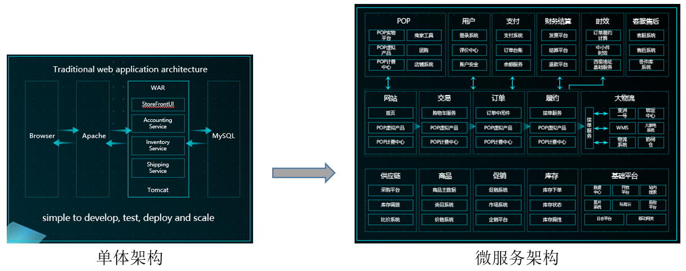
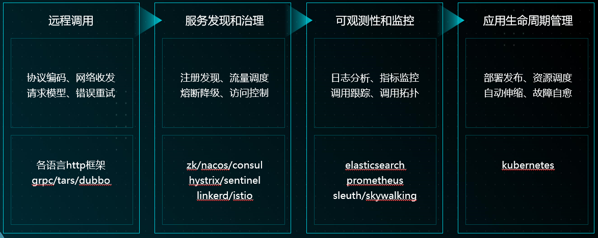

# 北极星是什么？

北极星是腾讯开源的服务发现和治理中心，致力于解决分布式或者微服务架构中的服务可见、故障容错、流量控制和安全问题。虽然，业界已经有些组件可以解决其中一部分问题，但是缺少一个标准的、多语言的、框架无关的实现。

腾讯具有海量的分布式服务，加上业务线和技术栈的多样性，沉淀了大大小小数十个相关组件。从 2019 年开始，我们通过北极星对这些组件进行抽象和整合，打造公司统一的服务发现和治理方案，帮助业务提升研发效率和运营质量。

目前，北极星在腾讯内部的服务注册数量超过百万，日接口调用量超过十万亿，通用性和稳定性都得到了大规模的验证。因此，我们将其贡献到开源社区，希望对其他企业有所帮助，也希望吸引更多开发者参与共建。下面从三个方面介绍北极星。

## 北极星诞生的背景

让我们回顾一下应用架构发现的历程：

### 单体架构：

单体架构的所有代码都在一个应用中，单体架构具备系统复杂度低，部署简单，易运维等优点，适合小规模或者初创期的业务。但随着应用模块和开发人员增加，单体应用面临众多问题，例如：

- 变更成本高：任何修改需要重新部署整个系统；
- 扩展性差：无法针对某些热点模块进行水平扩展；
- 故障扩散：某个模块出现故障也会影响其他模块；

### 微服务架构

对单体架构中的每一层进行细粒度的拆分，可以拆分成功整体更松散，模块更内聚的微服务架构。

微服务架构具备职责单一、平台无关的通信、独立性、进程隔离的特点。

微服务架构具备以下优点：

- 服务作为组件，可独立部署，独立变更，独立扩缩容。
- 团队管理变简单，可围绕业务来划分团队。
- 技术选择可多样性
- 业务进程及数据独立，故障不会相互影响。

### 微服务架构的实施中的核心问题

北极星主要解决的是“服务发现及治理”的问题。

## 北极星解决哪些问题

在分布式架构及微服务架构实施过程中，业务可能面临以下四类问题。北极星以服务为中心，提供一站式解决方案。

| 问题类型 | 问题示例                                                     | 解决方案 |
| -------- | ------------------------------------------------------------ | -------- |
| 服务可见 | 主调方如何知道被调方的服务地址                               | 注册发现 |
| 配置可见 | 如何实现服务配置的版本管理、动态下发、按需变更。             | 配置管理 |
| 故障容错 | 当被调方的部分实例异常时，如何屏蔽异常实例，屏蔽之后如何恢复 | 熔断降级 |
|          | 当某些主调方的请求量过多时，如何限制这些主调方的请求，避免影响其他主调方的请求 | 访问限流 |
| 流量控制 | 被调方包含多个实例，主调方如何确定请求发送到哪个实例，如何保证请求均衡 | 负载均衡 |
|          | 如何实现按地域就近、单元化隔离、金丝雀发布等各种请求调度策略 | 动态路由 |
|          | 外网到内网的调用链路如何进行加密，消息防窃听                 | 链路加密 |
|          | 服务资源如何按用户及角色进行授权                             | 服务鉴权 |

## 北极星具备哪些功能

北极星主要提供以下核心功能，各部分功能都是基于插件化设计，可单独使用，从功能大类来看，分为注册中心、配置中心以及服务网格三类功能：

### 注册中心

- 服务注册发现及服务健康检查

  以服务为中心的分布式应用架构，通过服务和注册发现的方式维护不断变化的请求地址，提高应用的扩展能力，降低应用的迁移成本。北极星提供对注册上来的服务实例进行健康检查，阻止主调方对不健康的服务实例发送请求，同时也提供了保护能力，实例剔除超过一定数量则停止剔除，防止因不健康实例过多导致雪崩效应。

### 配置中心

- 动态配置
  提供配置管理的功能，支持应用配置、公共配置的订阅发布、版本管理、变更通知，实现应用配置动态生效。

### 服务网格

- 路由和负载均衡
  
  根据请求标签、实例标签和标签匹配规则，对线上流量进行动态调度，可以应用于按地域就近、单元化隔离和金丝雀发布等多种场景。

- 熔断降级和限流
  
  提供熔断功能，根据实时采集的错误率等指标，及时熔断异常的服务、接口、实例或者实例分组，降低请求失败率。
  当负载已经超过了系统的最大处理能力时，北极星提供服务限流功能，可针对不同的请求来源和系统资源进行访问限流，避免服务被压垮。
  
- 可观测性
  
  提供服务治理可视化监控视图，支持请求量、请求延时和请求成功率的指标查询，支持服务调用关系和多维度的流量曲线查询，实现服务治理功能和流量观测一体化。
  
- Proxyless与Proxy接入

  提供多语言SDK、以及无侵入的JavaAgent，适配用户高性能低长尾时延以Porxyless模式的接入场景；同时提供独立的Sidecar，支持用户的低侵入性、基于流量接管的Proxy模式接入场景。

## 对比其他产品

虽然业界没有组件的形态和北极星完全相同，但是一些组件的功能和北极星有所重叠，下面介绍北极星和这些组件的区别。

## Eureka

从定位上来说，Eureka是服务注册中心，只提供服务发现、服务注册和健康检查功能。北极星是服务发现和治理中心，除服务发现、服务注册和健康检查之外，还提供流量控制、故障容错和安全能力。

从架构上来说，Eureka集群采用异步复制的方式同步数据，每个Server将收到的写请求异步复制给集群内的其他Server。当Client越来越多时，需要扩容Server。但是，增加Server也会增加Server之间的复制请求，导致扩容效果不明显。北极星服务端计算存储分离，计算层节点可以随着客户端节点的增加平行扩展，轻松支持百万级节点接入。

## Istio

Istio通过流量劫持的方式实现服务发现和治理，这种方式有些问题。首先，增加了资源消耗和请求延时，特别是CPU消耗，请求量大的业务难以接受。第二，每个企业使用的RPC协议各不相同，目前Istio主要支持HTTP和gRPC，难以快速支持其他RPC协议。第三，流量劫持直接影响业务的每个请求，稳定性和运维工作要求极高。最后，和主流微服务框架无法共存，业务改造的成本大、风险高。

北极星不仅提供无侵入Sidecar，还提供高性能SDK，实现语义相同的服务发现和治理功能，用户可以根据业务场景自行选择。对于请求量大和资源消耗敏感用户，可以在业务应用或者开发框架中集成北极星SDK，快速补齐服务发现和治理功能。